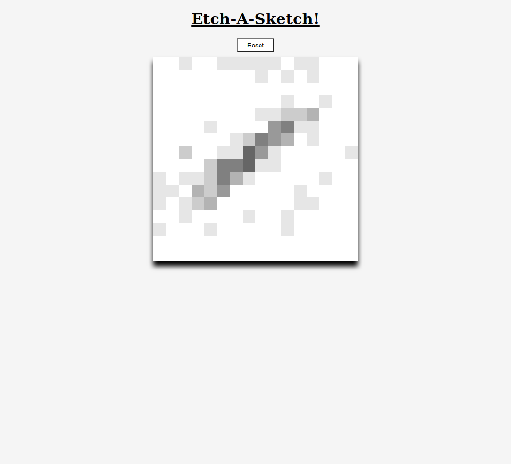

# odin-etch-a-sketch
Project creating a etch-a-sletch in the web browser for the Odin Project. 

Mouse over the canvas to draw onto it. 

Hit the reset button to refresh the canvas as white but also redefine the size of the canvas.

Three different pen modes: rainbow, for random colors; grey scale, for light to dark shades; erase, to set to white. 

