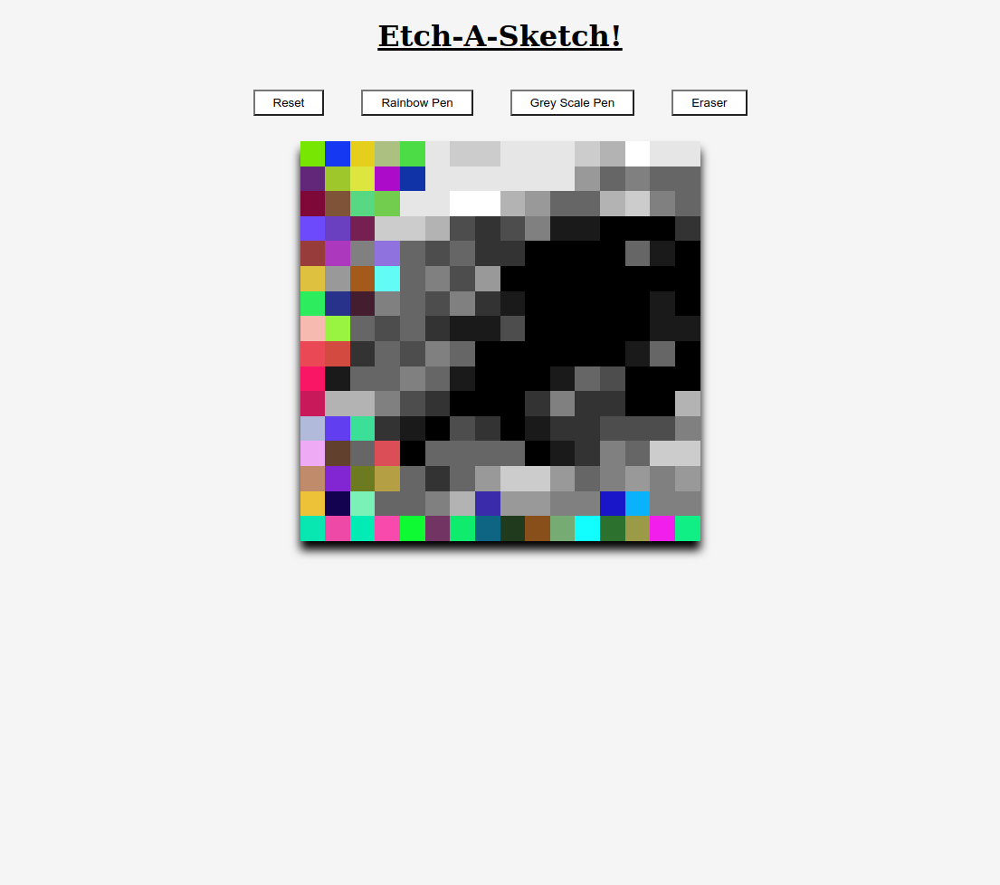

# odin-etch-a-sketch
Project creating a etch-a-sletch in the web browser for the Odin Project. 

Mouse over the canvas to draw onto it. Squares get darker each time they are moused over.

Hit the reset button to refresh the canvas as white but also redefine the size of the canvas.

